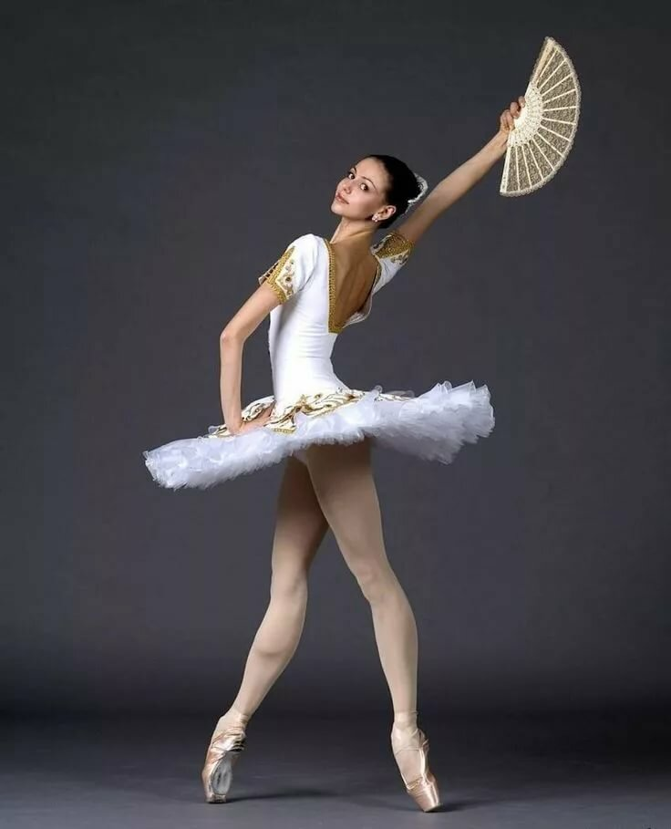
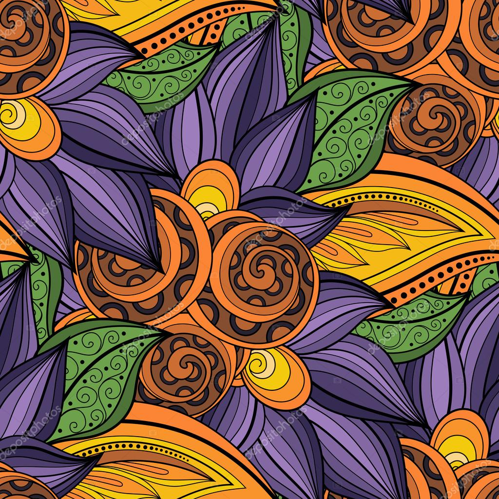
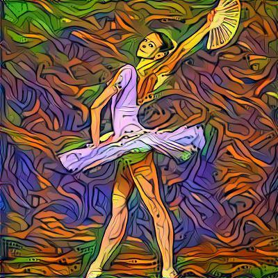
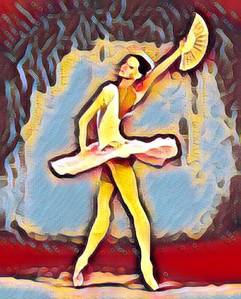

# Neyral Style Transfer Bot for Telegram

В данном репозитории находится код бота, работающего по принципу приложения Prisma. Сначала необходимо прислать свое фото, которое требуется изменить, затем либо выбрать стиль из предложенных, либо прислать фото на в качестве фотографии стиля. Желательно, чтобы это были какие-то цветные орнаменты или росписи. Но в этом случае придется подождать. 

В боте используется два способа Transer Style:
1. При отправке своего фото в качестве стиля используется медленный алгоритм по статье <https://arxiv.org/abs/1508.06576>
Леона А. Гатиса, Александра С. Эккера и Маттиаса Бетге. <https://pytorch.org/tutorials/beginner/transfer_learning_tutorial.html>

  

2. При выборе предложенного стиля используется алгоритм на основе предобученной MSG-Net <https://github.com/zhanghang1989/PyTorch-Multi-Style-Transfer>

  


Развернуть бота на локальной машине или сервере можно двумя способами:

1. Вручную:
   1. Клонируете репозиторий ```git clone https://github.com/e-mois/nstbot```
   2. Переходите в клонированную папку ```cd nstbot```
   3. Устанавливаете зависимости ```pip install -r requirements.txt```
   4. Добавляете в файл config.py токен и свой id
   5. Выполняете в консоли ```python main.py```

2. С помощью Docker (при наличии установленного Docker и Docker Compose):
   1. Клонируете репозиторий ```git clone https://github.com/e-mois/nstbot```
   2. Переходите в клонированную папку ```cd nstbot```
   3. Запускаете ```docker-compose up --build```. Все зависимости установятся из Docker-контейнера и бот автоматически запустится.

